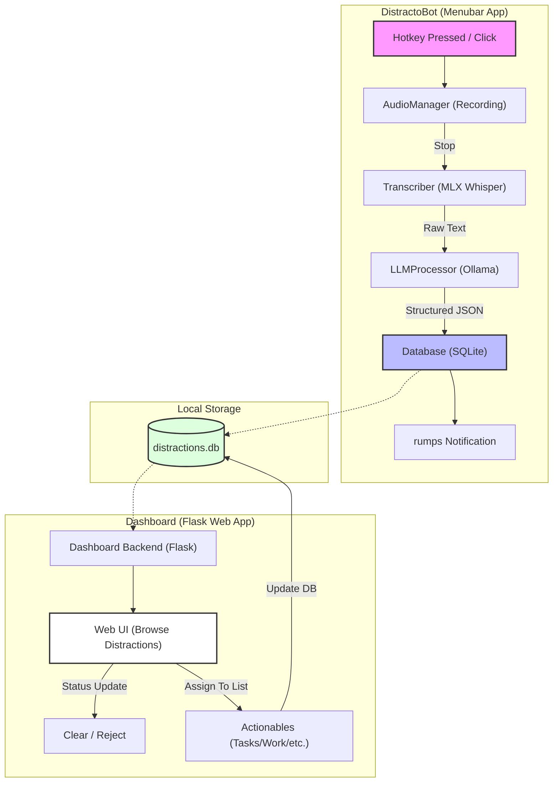

# DistractoBot & Dashboard Architecture

This document illustrates the flow of data from capturing a spoken thought to managing it as an actionable task on the dashboard.

## 🏗 System Overview

The system is split into two primary components:
1. **DistractoBot**: A native macOS menu bar app that listens for hotkeys and processes audio locally.
2. **Dashboard**: A Flask-based web interface for reviewing, filtering, and organizing captured distractions into lists.

## 🔄 Data Flow Diagram

## 🧩 Component Breakdown

### 1. DistractoBot Components
- **`audio_manager.py`**: Handles microphone access, file paths, and threading for clean audio capture.
- **`transcriber.py`**: Uses local Apple Silicon optimized Whisper models to convert audio to text.
- **`llm_processor.py`**: Sends the transcribed text to Ollama (likely Gemma or Llama models) to extract structured data (Intent, Source, Summary).
- **`database.py`**: Simple SQLite wrapper for the `thoughts` and `actionables` tables.

### 2. Dashboard Features
- **Distraction Inbox**: Shows all "open" thoughts with their AI-generated summaries.
- **Filtering**: Allows searching by source or summary and filtering by date.
- **Actionable System**: 
  - Allows assigning a thought to a specific **List Type** (e.g., Home, Work, Groceries).
  - Supports **Subtypes** for extra granularity.
  - Automatically marks the original thought as "cleared" once assigned.

## 🛠 Tech Stack
- **Backend/Logic**: Python
- **UI (App)**: `rumps` (macOS native menu bar)
- **UI (Dashboard)**: Flask, HTML5, Vanilla CSS, JavaScript
- **AI Engine**: MLX-Whisper (Transcription), Ollama (Categorization)
- **Persistence**: SQLite3
